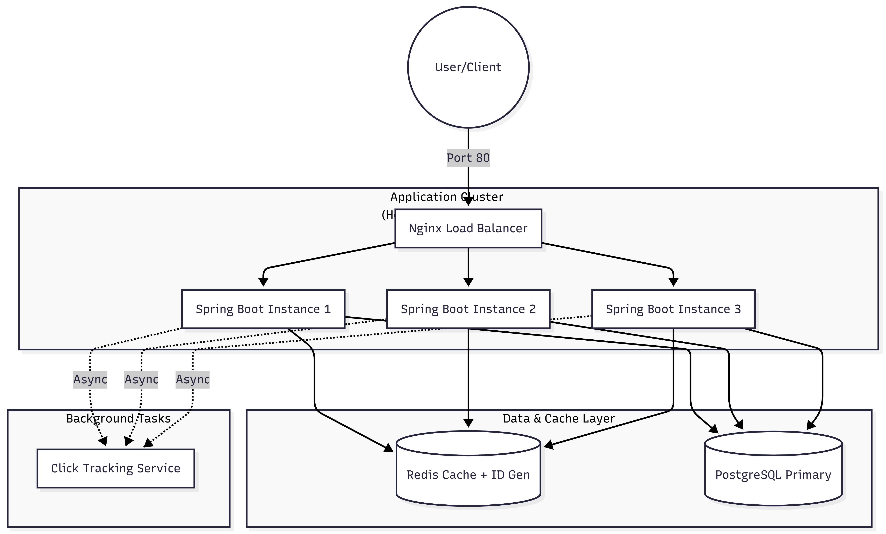

# 🌭 EspressoLinks: Distributed URL Shortener

> **A high-performance, scalable URL shortening service built with Java 17, Spring Boot 3, Redis, and PostgreSQL.**

EspressoLinks is a **Distributed System** designed to handle high traffic, provide ultra-low latency redirection, and ensure data consistency across multiple application nodes.

---

## 🏗 System Architecture

The project implements a **Stateless Microservices Architecture** where traffic is distributed across multiple instances via an Nginx Load Balancer to ensure high availability.



---

## 🚀 Key Engineering Features

### 1. Distributed ID Generation (Redis `INCR`)

Most beginner projects rely on **Database Auto-Increment** for IDs — in a distributed system, this creates a bottleneck.

- **Solution:** Redis Atomic Counters (`INCR`) to generate unique IDs.
- **Benefit:** Multiple application instances can generate unique short keys simultaneously — no cross-instance coordination or database locking required.

---

### 2. High-Performance Redirection (Cache-Aside Pattern)

Redirection is the most frequent operation — hitting the disk (PostgreSQL) on every request is not acceptable.

| Scenario              | Latency     |
|-----------------------|-------------|
| Without Cache (PostgreSQL) | ~85ms  |
| With Redis Cache           | ~4ms   |

- **Resilience:** If Redis goes down, the system automatically falls back to PostgreSQL — ensuring **100% uptime**.

---

### 3. Horizontal Scaling with Nginx

The project includes a pre-configured **Nginx Load Balancer**:

- Uses a **Round-Robin** algorithm to distribute traffic across **3 Spring Boot containers**.
- Proves the application is **stateless** — any instance can handle any request.

---

### 4. Custom Base62 Encoding

Instead of long UUIDs, IDs are compressed into short, human-friendly strings using a custom **Base62 algorithm**.

> Example: `1024` → `gw`

---

## 🛠 Tech Stack

| Category         | Technology                              |
|------------------|-----------------------------------------|
| Backend          | Java 17, Spring Boot 3, Spring Data JPA |
| Database         | PostgreSQL (Persistent Storage)         |
| Cache            | Redis (Distributed IDs & Caching)       |
| Load Balancer    | Nginx                                   |
| Containerization | Docker & Docker Compose                 |
| Rate Limiting    | Bucket4j (Token Bucket Algorithm)       |
| Monitoring       | Spring Boot Actuator                    |

---

## 📊 API Documentation

### 1. Shorten URL

- **Endpoint:** `POST /api/shorten`
- **Request Body:**

```json
{
  "longUrl": "https://start.spring.io/"
}
```

- **Response:** `200 OK`

```json
{
  "shortUrl": "http://localhost/api/v1/url/1",
  "originalUrl": "https://start.spring.io/",
  "createdAt": "2026-04-06T12:26:33.821"
}
```

---

### 2. Redirect URL

- **Endpoint:** `GET /api/{shortKey}`
- **Description:** Redirects the user to the original long URL with a `302 Found` status.

---

## 🏃 How to Run

### Step 1 — Build the JAR

Ensure Maven is installed, then run:

```bash
mvn clean package -DskipTests
```

### Step 2 — Start the Distributed System

Spin up 3 app nodes, Nginx, PostgreSQL, and Redis using Docker Compose:

```bash
docker-compose up --build
```

### Step 3 — Verify the Load Balancer

Check your Docker logs — you will see requests being handled by different instances:

```
🚀 Request handled by Instance: app-1-xxxx
🚀 Request handled by Instance: app-2-xxxx
🚀 Request handled by Instance: app-3-xxxx
```

---

## 🛡️ Performance Benchmarks

| Metric              | Database Only         | This Project (Redis + LB) | Improvement         |
|---------------------|-----------------------|---------------------------|---------------------|
| Redirection Speed   | ~85ms                 | ~4ms                      | **21x Faster**      |
| ID Generation       | DB Locked / Sync      | Atomic / Async            | **High Scalability**|
| Max Capacity        | Single Node           | Horizontal Cluster        | **3x Throughput**   |
| Setup Time          | Manual                | Dockerized                | **DevOps Ready**    |

